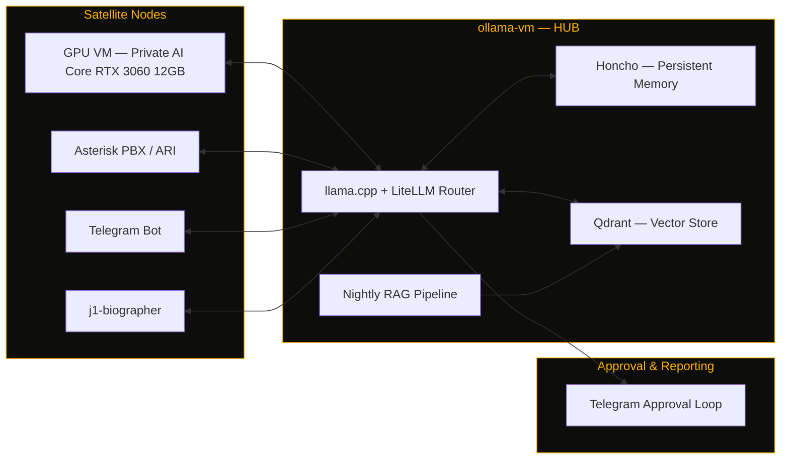

<div align="center">


# OneByJorah

Network Security Administrator


</div>

---

<p align="center">
  
</p>

<br/>

## `> whoami`

```
NAME        Jhonattan L. Jimenez ("JorahOne")
ROLE        Network Security Administrator — JorahOne Networks
SIDE        Founder, JorahOne LLC — solo MSP for SMBs (AD, network security, M365)
LOCATION    St. Thomas, U.S. Virgin Islands
STACK       Windows Server · Active Directory · Docker · PowerShell · self-hosted everything
PHILOSOPHY  Tailscale-only exposure · CLI over GUI · self-hosted over SaaS · MIT-licensed
UPTIME      Since [career start] — zero unplanned AD outages on my watch
```

<br/>

## `> ops-status`

<br/>

## `> architecture — hermes hub & satellite`



<sub>Archipelago metaphor, on purpose: every node self-hosted, every link Tailscale-only, every deploy MIT-licensed.</sub>

<br/>

## `> current-deployments`

<table>
<tr>
<td width="50%" valign="top">

**Hermes AI Infrastructure**
Hub-and-satellite multi-agent system. `ollama-vm` running llama.cpp + LiteLLM, Honcho for persistent memory, Qdrant for vector storage, nightly RAG pipeline, Telegram-based approval loop. GPU satellite node runs a private inference core via FastAPI gateway.
`STATUS: OPERATIONAL`

</td>
<td width="50%" valign="top">

**Enterprise Network Operations**
Enterprise AD replication monitoring, animated NOC topology dashboards, Aruba switch SNMP dashboards, and DHCP/AD subnet discovery tooling across distributed multi-site Windows environments.
`STATUS: MONITORING`

</td>
</tr>
<tr>
<td width="50%" valign="top">

**Self-Hosted VoIP**
Asterisk PBX with PJSIP/ARI, over Tailscale, Cloudflare Tunnel for external SIP under the JorahOne Networks brand — no public port exposure.
`STATUS: OPERATIONAL`

</td>
<td width="50%" valign="top">

**j1-biographer**
Voice AI biographer agent merging Asterisk ARI + Telegram inputs into a shared Hermes brain for memoir-quality, memory-augmented life storytelling.
`STATUS: IN DEVELOPMENT`

</td>
</tr>
<tr>
<td width="50%" valign="top">

**CIPHER — AI-Driven SOC**
FastAPI backend integrating Suricata, Zeek, Wazuh, and OpenVAS for enterprise threat detection and response.
`STATUS: IN DEVELOPMENT`

</td>
<td width="50%" valign="top">

**TRANKILO**
Streetclothing brand with a self-hosted social media agent — Postiz, ComfyUI, Umami, n8n, Honcho, Telegram approval loop. Brand voice: calm as strength.
`STATUS: OPERATIONAL`

</td>
</tr>
</table>

<br/>

## `> changelog`

```
[RECENT]     Aruba SNMP dashboards · GCDS/Entra Connect directory sync · iOS on-device LLM (Hermes)
             PowerShell DHCP/AD subnet discovery tooling · CIPHER SOC buildout

[EARLIER]    jorahone-ai-stack Docker Compose (Honcho + Qdrant + LiteLLM + Caddy)
             J1-FLEET (Three.js fleet dashboard) · J1-PULSE (uptime monitor) · J1-BENCH (LLM eval harness)
             StackDeploy multi-service orchestration · hermes-realm (PixiJS archipelago viz)

[FOUNDATION] j1-adrepl-monitor — open-sourced AD replication daemon for 35+ DC environment
             NOC Operations Platform v5.0 · JorahOne MSP framework (SOPs, SLAs, onboarding playbooks)
```

<br/>

## `> featured-repos`

<br/>

## `> tech-stack`

<br/>

## `> stats`

<br/>

## `> activity-graph`

<br/>

## `> contribution-snake`

<sub>Renders once the `snake.yml` workflow (included alongside this README) runs for the first time — see setup notes below.</sub>

<br/>

## `> philosophy`

```
"Every satellite reports to the hub. Every hub answers to Tailscale.
 Nothing public that doesn't have to be. Nothing manual that can be scripted."
```

<br/>

## `> connect`


---
Part of the JorahOne / J1 ecosystem — personal profile for the VIDE OIT infrastructure.

## 🤝 Contributing

See [CONTRIBUTING.md](CONTRIBUTING.md). All contributions follow the [Code of Conduct](CODE_OF_CONDUCT.md).

## 🔒 Security

Found a vulnerability? Please follow our [Security Policy](SECURITY.md) and report privately to `security@jorahone.com`.

## 📄 License

[MIT License](LICENSE) © Jhonattan L. Jimenez (OneByJorah)

---

<p align="center">Built with 🌴 by <a href="https://github.com/OneByJorah">OneByJorah</a> · <a href="https://jorahone.com">jorahone.com</a></p>
