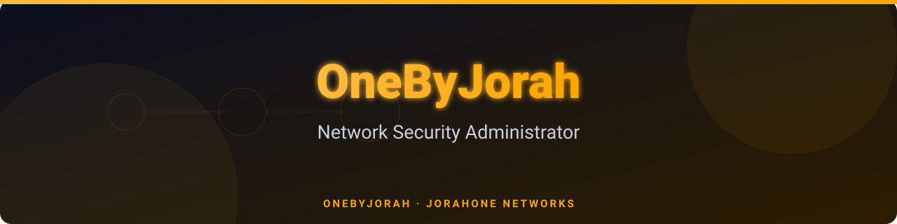
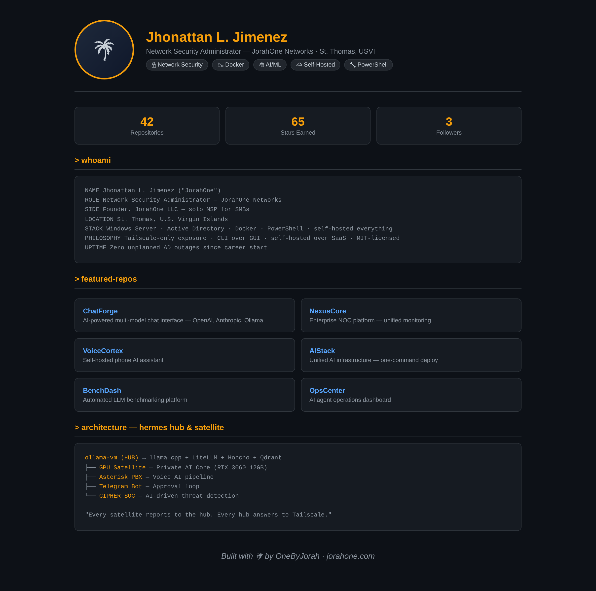
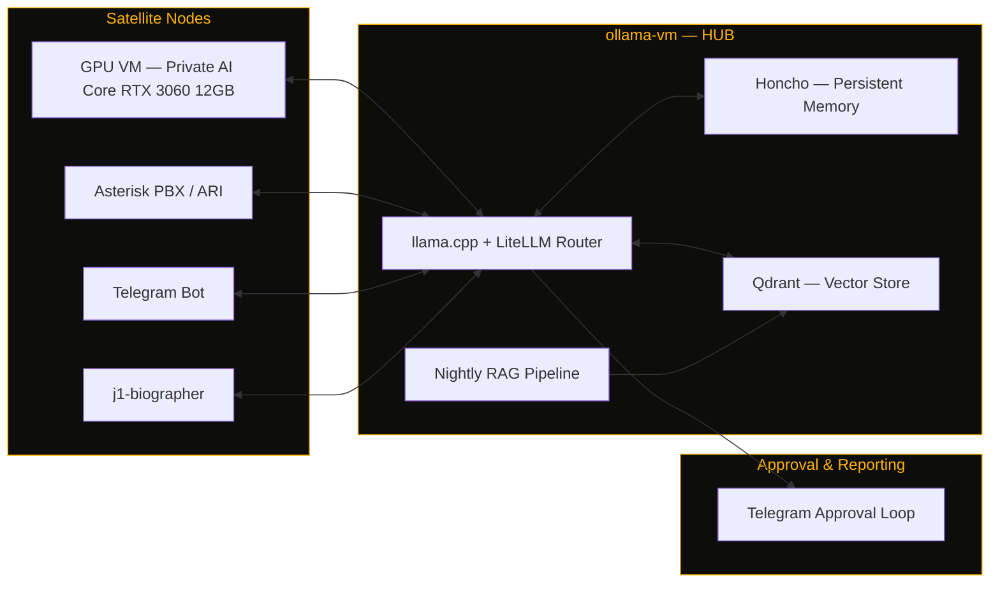

<div align="center">



# OneByJorah

Network Security Administrator — JorahOne Networks

[](LICENSE)
[](https://maps.google.com/?q=St+Thomas+USVI)
[](#-tech-stack)
[](https://github.com/OneByJorah)
[](https://github.com/OneByJorah?tab=repositories)

</div>

---

<p align="center">
  
</p>

## `> whoami`

```
NAME        Jhonattan L. Jimenez ("JorahOne")
ROLE        Network Security Administrator — JorahOne Networks
SIDE        Founder, JorahOne LLC — solo MSP for SMBs (AD, network security, M365)
LOCATION    St. Thomas, U.S. Virgin Islands
STACK       Windows Server · Active Directory · Docker · PowerShell · self-hosted everything
PHILOSOPHY  Tailscale-only exposure · CLI over GUI · self-hosted over SaaS · MIT-licensed
UPTIME      Zero unplanned AD outages since career start
```

## `> ops-status`

| Node | Purpose | State |
|---|---|---|
| `ollama-vm` | Main Hermes inference node — llama.cpp + LiteLLM | operational |
| `gpu-satellite` | Private AI core — Ornith-1.0-9B on RTX 3060 12 GB | operational |
| `voice.jorahone.com` | Asterisk PBX stack with PJSIP + Snom endpoints | operational |
| `j1-biographer` | Voice AI memoir agent | in development |
| `CIPHER` | AI-driven SOC — Suricata, Zeek, Wazuh, OpenVAS | in development |

## `> architecture — hermes hub & satellite`



<sub>Archipelago metaphor, on purpose: every node self-hosted, every link Tailscale-only, every deploy MIT-licensed.</sub>

## `> current-deployments`

<table>
<tr>
<td width="50%" valign="top">

**Hermes AI Infrastructure**
Hub-and-satellite multi-agent system. `ollama-vm` running llama.cpp + LiteLLM, Honcho for persistent memory, Qdrant for vector storage, nightly RAG pipeline, Telegram-based approval loop. GPU satellite node runs a private inference core via FastAPI gateway.
`STATUS: OPERATIONAL`

</td>
<td width="50%" valign="top">

**Enterprise Network Operations**
Enterprise AD replication monitoring, animated NOC topology dashboards, Aruba switch SNMP dashboards, and DHCP/AD subnet discovery tooling across distributed multi-site Windows environments.
`STATUS: MONITORING`

</td>
</tr>
<tr>
<td width="50%" valign="top">

**Self-Hosted VoIP**
Asterisk PBX with PJSIP/ARI, over Tailscale, Cloudflare Tunnel for external SIP under the JorahOne Networks brand — no public port exposure.
`STATUS: OPERATIONAL`

</td>
<td width="50%" valign="top">

**j1-biographer**
Voice AI biographer agent merging Asterisk ARI + Telegram inputs into a shared Hermes brain for memoir-quality, memory-augmented life storytelling.
`STATUS: IN DEVELOPMENT`

</td>
</tr>
<tr>
<td width="50%" valign="top">

**CIPHER — AI-Driven SOC**
FastAPI backend integrating Suricata, Zeek, Wazuh, and OpenVAS for enterprise threat detection and response.
`STATUS: IN DEVELOPMENT`

</td>
<td width="50%" valign="top">

**TRANKILO**
Streetclothing brand with a self-hosted social media agent — Postiz, ComfyUI, Umami, n8n, Honcho, Telegram approval loop. Brand voice: calm as strength.
`STATUS: OPERATIONAL`

</td>
</tr>
</table>

## `> changelog`

```
[RECENT]     Aruba SNMP dashboards · GCDS/Entra Connect directory sync · iOS on-device LLM (Hermes)
             PowerShell DHCP/AD subnet discovery tooling · CIPHER SOC buildout

[EARLIER]    jorahone-ai-stack Docker Compose (Honcho + Qdrant + LiteLLM + Caddy)
             J1-FLEET (Three.js fleet dashboard) · J1-PULSE (uptime monitor) · J1-BENCH (LLM eval harness)
             StackDeploy multi-service orchestration · hermes-realm (PixiJS archipelago viz)

[FOUNDATION] j1-adrepl-monitor — open-sourced AD replication daemon for 35+ DC environment
             NOC Operations Platform v5.0 · JorahOne MSP framework (SOPs, SLAs, onboarding playbooks)
```

## `> featured-repos`

<table>
<tr>
  <td width="50%" valign="top">
    <h3><a href="https://github.com/OneByJorah/ChatForge">ChatForge</a></h3>
    
    <p>AI-powered chat interface — multi-model support (OpenAI, Anthropic, Ollama), real-time WebSocket streaming</p>
    
    
    
  </td>
  <td width="50%" valign="top">
    <h3><a href="https://github.com/OneByJorah/AIStack">AIStack</a></h3>
    
    <p>Unified AI infrastructure stack — Docker Compose deployment for Ollama, Qdrant, LiteLLM, Honcho + Caddy</p>
    
    
    
  </td>
</tr>
<tr>
  <td width="50%" valign="top">
    <h3><a href="https://github.com/OneByJorah/BenchDash">BenchDash</a></h3>
    <p>Automated benchmarking platform for local LLMs on Ollama — auto-discover, test, rank, and visualize</p>
    
    
  </td>
  <td width="50%" valign="top">
    <h3><a href="https://github.com/OneByJorah/NexusCore">NexusCore</a></h3>
    <p>Enterprise NOC platform — unified monitoring for AD, NTP, DNS, PBX, helpdesk, and AI-powered alerting</p>
    
    
  </td>
</tr>
<tr>
  <td width="50%" valign="top">
    <h3><a href="https://github.com/OneByJorah/VoiceCortex">VoiceCortex</a></h3>
    <p>Self-hosted phone AI assistant — real-time voice conversations over telephone via STT > LLM > TTS</p>
    
    
  </td>
  <td width="50%" valign="top">
    <h3><a href="https://github.com/OneByJorah/OpsCenter">OpsCenter</a></h3>
    <p>AI agent operations dashboard — real-time monitoring, task management, fleet visibility for Hermes agents</p>
    
    
  </td>
</tr>
<tr>
  <td width="50%" valign="top">
    <h3><a href="https://github.com/OneByJorah/SentryView">SentryView</a></h3>
    <p>Self-hosted RTSP NVR dashboard — live monitoring, recording, and timeline review for IP cameras</p>
    
    
  </td>
  <td width="50%" valign="top">
    <h3><a href="https://github.com/OneByJorah/CommandDesk">CommandDesk</a></h3>
    <p>Self-hosted AI helpdesk agent — multi-platform ticketing, email-to-ticket, AI auto-response</p>
    
    
  </td>
</tr>
<tr>
  <td width="50%" valign="top">
    <h3><a href="https://github.com/OneByJorah/PrimeHub">PrimeHub</a></h3>
    <p>Portfolio hub — repo health, standardization status, and ecosystem overview for OneByJorah infrastructure</p>
    
    
  </td>
  <td width="50%" valign="top">
    <h3><a href="https://github.com/OneByJorah/VirtOffice">VirtOffice</a></h3>
    <p>Animated 3D virtual office for Hermes AgentOS subagents — real-time isometric AI visualization</p>
    
    
  </td>
</tr>
<tr>
  <td width="50%" valign="top">
    <h3><a href="https://github.com/OneByJorah/ConfigVault">ConfigVault</a></h3>
    <p>Network backup and asset management dashboard — device inventory, backup scheduling, snapshot restore</p>
    
    
  </td>
  <td width="50%" valign="top">
    <h3><a href="https://github.com/OneByJorah/DirWatch">DirWatch</a></h3>
    <p>Active Directory DC monitoring dashboard — real-time health, replication status, and alerting</p>
    
    
  </td>
</tr>
<tr>
  <td width="50%" valign="top">
    <h3><a href="https://github.com/OneByJorah/MSPEngine">MSPEngine</a></h3>
    <p>Windows 10/11 provisioning and debloat utility for MSP technicians — one-click setup</p>
    
    
  </td>
  <td width="50%" valign="top">
    <h3><a href="https://github.com/OneByJorah/StackForge">StackForge</a></h3>
    <p>Multi-service container orchestration — deploy and manage complex Docker stacks</p>
    
    
  </td>
</tr>
</table>

## `> tech-stack`

<p>
  
  
  
  
  
  
  
  
  
  
  
</p>

## `> stats`

<p align="center">
  
  
</p>

## `> activity-graph`

<p align="center">
  
</p>

## `> contribution-snake`

<p align="center">
  
</p>

## `> philosophy`

```
"Every satellite reports to the hub. Every hub answers to Tailscale.
 Nothing public that doesn't have to be. Nothing manual that can be scripted."
```

## `> connect`

- 🌐 Portfolio: [jorahone.com](https://jorahone.com)
- 📡 VoIP site: [voice.jorahone.com](https://voice.jorahone.com)
- 🐙 GitHub Org: [JorahOne-Services](https://github.com/JorahOne-Services)
- 📧 Contact: info@jorahone.com

---

<p align="center">Built with 🌴 by <a href="https://github.com/OneByJorah">OneByJorah</a> · <a href="https://jorahone.com">jorahone.com</a></p>
