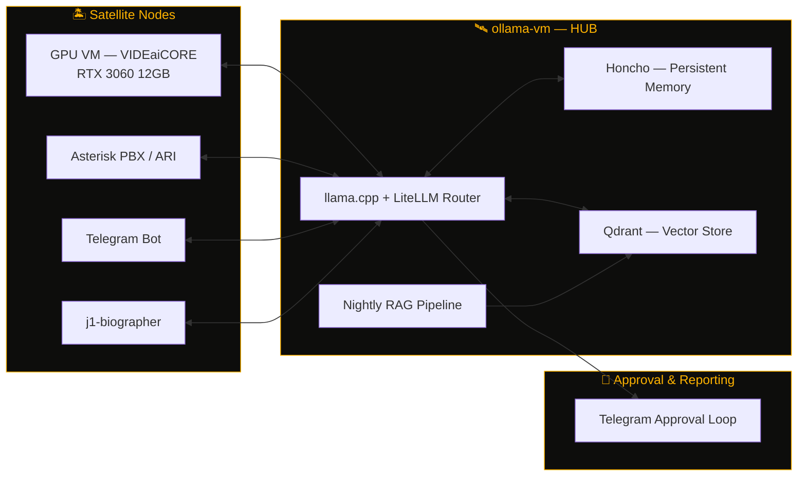

<div align="center">


[](https://github.com/OneByJorah)
[](https://github.com/OneByJorah?tab=followers)
[](https://jorahone.com)
[](https://github.com/JorahOne-Services)

</div>

<br/>

## `> whoami`

```
NAME        Jhonattan L. Jimenez ("JorahOne")
ROLE        Network Security Administrator — VIDE Office of Information Technology
SCOPE       35+ domain controllers across St. Thomas (STT) & St. Croix (STX) districts
SIDE        Founder, JorahOne LLC — solo MSP for SMBs (AD, network security, M365)
LOCATION    St. Croix, U.S. Virgin Islands
STACK       Windows Server · Active Directory · Docker · PowerShell · self-hosted everything
PHILOSOPHY  Tailscale-only exposure · CLI over GUI · self-hosted over SaaS · MIT-licensed
UPTIME      Since [career start] — zero unplanned AD outages on my watch
```

<br/>

## `> ops-status`

<div align="center">

| Node | Function | Status |
|---|---|---|
| `ollama-vm` | Hermes primary inference (llama.cpp + LiteLLM) | 🟡 `OPERATIONAL` |
| `gpu-satellite` | VIDEaiCORE (Ornith-1.0-9B, RTX 3060 12GB) | 🟡 `OPERATIONAL` |
| `voice.jorahone.com` | Asterisk PBX / PJSIP / Mitel 6900s | 🟡 `OPERATIONAL` |
| `VIDE-STT / VIDE-STX` | 35+ Domain Controllers | 🟢 `MONITORED` |
| `j1-biographer` | Voice AI memoir agent | 🟠 `IN DEVELOPMENT` |
| `CIPHER` | AI-driven SOC (Suricata/Zeek/Wazuh/OpenVAS) | 🟠 `IN DEVELOPMENT` |

</div>

<br/>

## `> architecture — hermes hub & satellite`



<sub>Archipelago metaphor, on purpose: every node self-hosted, every link Tailscale-only, every deploy MIT-licensed.</sub>

<br/>

## `> current-deployments`

<table>
<tr>
<td width="50%" valign="top">

**🛰️ Hermes AI Infrastructure**
Hub-and-satellite multi-agent system. `ollama-vm` running llama.cpp + LiteLLM, Honcho for persistent memory, Qdrant for vector storage, nightly RAG pipeline, Telegram-based approval loop. GPU satellite node runs VIDEaiCORE via FastAPI gateway.
`STATUS: OPERATIONAL`

</td>
<td width="50%" valign="top">

**🏢 VIDE Network Operations**
Enterprise AD replication monitoring, animated NOC topology dashboards, Aruba switch SNMP dashboards (J1-SW-STX-CORE01), and DHCP/AD subnet discovery tooling across a distributed multi-district Windows environment.
`STATUS: MONITORING`

</td>
</tr>
<tr>
<td width="50%" valign="top">

**📞 Self-Hosted VoIP**
Asterisk PBX with PJSIP/ARI, Mitel 6900 phones over Tailscale, Cloudflare Tunnel for external SIP under the JorahOne Networks brand — no public port exposure.
`STATUS: OPERATIONAL`

</td>
<td width="50%" valign="top">

**🎙️ j1-biographer**
Voice AI biographer agent merging Asterisk ARI + Telegram inputs into a shared Hermes brain for memoir-quality, memory-augmented life storytelling.
`STATUS: IN DEVELOPMENT`

</td>
</tr>
<tr>
<td width="50%" valign="top">

**🛡️ CIPHER — AI-Driven SOC**
FastAPI backend integrating Suricata, Zeek, Wazuh, and OpenVAS for VIDE OIT threat detection and response.
`STATUS: IN DEVELOPMENT`

</td>
<td width="50%" valign="top">

**👕 TRANKILO**
Streetclothing brand with a self-hosted social media agent — Postiz, ComfyUI, Umami, n8n, Honcho, Telegram approval loop. Brand voice: calm as strength.
`STATUS: OPERATIONAL`

</td>
</tr>
</table>

<br/>

## `> changelog`

```
[RECENT]     Aruba SNMP dashboards · GCDS/Entra Connect directory sync · iOS on-device LLM (Hermes)
             PowerShell DHCP/AD subnet discovery tooling · CIPHER SOC buildout

[EARLIER]    jorahone-ai-stack Docker Compose (Honcho + Qdrant + LiteLLM + Caddy)
             J1-FLEET (Three.js fleet dashboard) · J1-PULSE (uptime monitor) · J1-BENCH (LLM eval harness)
             StackDeploy multi-service orchestration · hermes-realm (PixiJS archipelago viz)

[FOUNDATION] j1-adrepl-monitor — open-sourced AD replication daemon for 35+ DC environment
             NOC Operations Platform v5.0 · JorahOne MSP framework (SOPs, SLAs, onboarding playbooks)
```

<br/>

## `> featured-repos`

<div align="center">

[](https://github.com/OneByJorah/ADSentinel)
[](https://github.com/OneByJorah/SentryView)
[](https://github.com/OneByJorah/hermes-3d-office)
[](https://github.com/OneByJorah/J1-MSP-Toolkit)

</div>

<br/>

## `> tech-stack`

<div align="center">

**Infrastructure & Identity**


**Self-Hosted & Networking**


**AI / Automation**


**Monitoring & Security**


</div>

<br/>

## `> stats`

<div align="center">


</div>

<div align="center">


</div>

<br/>

## `> activity-graph`

<div align="center">

</div>

<br/>

## `> contribution-snake`

<div align="center">

</div>

<sub>Renders once the `snake.yml` workflow (included alongside this README) runs for the first time — see setup notes below.</sub>

<br/>

## `> philosophy`

```
"Every satellite reports to the hub. Every hub answers to Tailscale.
 Nothing public that doesn't have to be. Nothing manual that can be scripted."
```

<br/>

## `> connect`

<div align="center">

📍 St. Croix, U.S. Virgin Islands &nbsp;|&nbsp; 🏢 JorahOne LLC &nbsp;|&nbsp; 🛰️ [JorahOne-Services](https://github.com/JorahOne-Services)

[](https://jorahone.com)
[](#)

<sub>Archipelago metaphor intentional — every node self-hosted, every link Tailscale-only, every deploy MIT-licensed.</sub>

</div>


