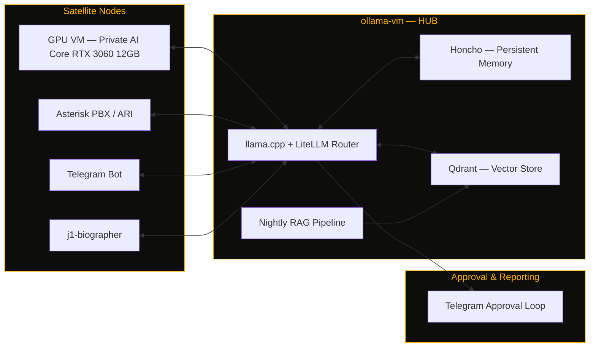
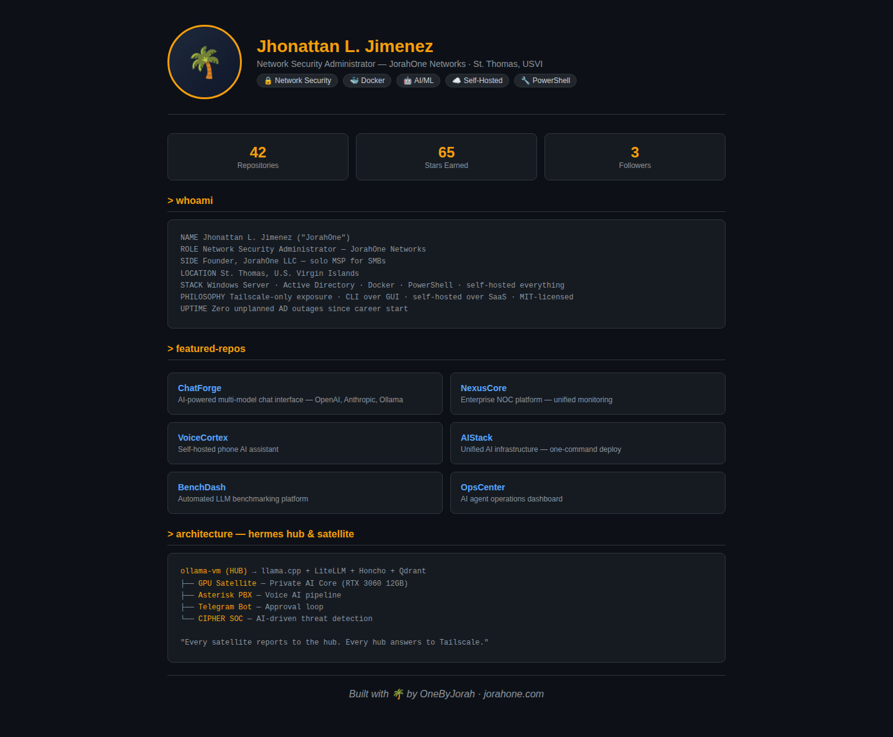
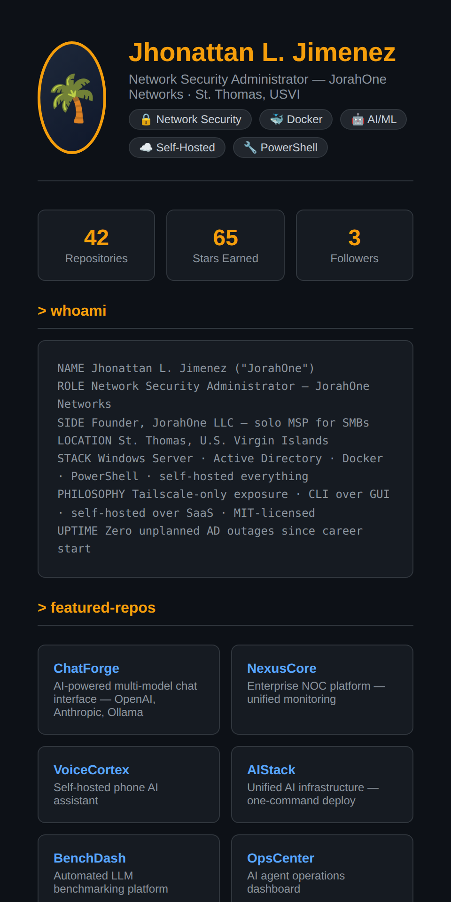

<div align="center">


# OneByJorah

**Network Security Administrator at JorahOne Networks — I build and self-host the infrastructure that keeps small businesses secure, connected, and automated.**

<a href="https://github.com/OneByJorah?tab=repositories"></a>
<a href="https://github.com/OneByJorah"></a>


</div>


## What This Is

This is the org profile repository for **JorahOne Networks**. It is not an application — it is the front page that describes who I am, how I work, and the self-hosted infrastructure behind the tools in this org.

Every project here follows the same philosophy: **nothing public that doesn't have to be, nothing manual that can be scripted**. Exposure is Tailscale-only by default, CLI is preferred over GUI, self-hosted over SaaS, and everything is MIT-licensed.

## `> whoami`

```
NAME        Jhonattan L. Jimenez ("JorahOne")
ROLE        Network Security Administrator — JorahOne Networks
SIDE        Founder, JorahOne LLC — solo MSP for SMBs (AD, network security, M365)
LOCATION    St. Thomas, U.S. Virgin Islands
STACK       Windows Server · Active Directory · Docker · PowerShell · self-hosted everything
PHILOSOPHY  Tailscale-only exposure · CLI over GUI · self-hosted over SaaS · MIT-licensed
```

## `> architecture — hermes hub & satellites`



<sub>Archipelago metaphor, on purpose: every node self-hosted, every link Tailscale-only, every deploy MIT-licensed.</sub>

## `> ops-status`

| Node | Purpose | State |
|---|---|---|
| `ollama-vm` | Main Hermes inference node — llama.cpp + LiteLLM | operational |
| `gpu-satellite` | Private AI core — Ornith-1.0-9B on RTX 3060 12 GB | operational |
| `voice.jorahone.com` | Asterisk PBX stack with PJSIP + Snom endpoints | operational |
| `j1-biographer` | Voice AI memoir agent | in development |
| `CIPHER` | AI-driven SOC — Suricata, Zeek, Wazuh, OpenVAS | in development |

## `> current-deployments`

<table>
<tr>
<td width="50%" valign="top">

**Hermes AI Infrastructure**
Hub-and-satellite multi-agent system. `ollama-vm` running llama.cpp + LiteLLM, Honcho for persistent memory, Qdrant for vector storage, nightly RAG pipeline, Telegram-based approval loop. GPU satellite node runs a private inference core via FastAPI gateway.
`STATUS: OPERATIONAL`

</td>
<td width="50%" valign="top">

**Enterprise Network Operations**
Enterprise AD replication monitoring, animated NOC topology dashboards, Aruba switch SNMP dashboards, and DHCP/AD subnet discovery tooling across distributed multi-site Windows environments.
`STATUS: MONITORING`

</td>
</tr>
<tr>
<td width="50%" valign="top">

**Self-Hosted VoIP**
Asterisk PBX with PJSIP/ARI, over Tailscale, Cloudflare Tunnel for external SIP under the JorahOne Networks brand — no public port exposure.
`STATUS: OPERATIONAL`

</td>
<td width="50%" valign="top">

**j1-biographer**
Voice AI biographer agent merging Asterisk ARI + Telegram inputs into a shared Hermes brain for memoir-quality, memory-augmented life storytelling.
`STATUS: IN DEVELOPMENT`

</td>
</tr>
<tr>
<td width="50%" valign="top">

**CIPHER — AI-Driven SOC**
FastAPI backend integrating Suricata, Zeek, Wazuh, and OpenVAS for enterprise threat detection and response.
`STATUS: IN DEVELOPMENT`

</td>
<td width="50%" valign="top">

**TRANKILO**
Streetclothing brand with a self-hosted social media agent — Postiz, ComfyUI, Umami, n8n, Honcho, Telegram approval loop. Brand voice: calm as strength.
`STATUS: OPERATIONAL`

</td>
</tr>
</table>

## `> featured-repos`

<table>
<tr>
  <td width="50%" valign="top">
    <h3><a href="https://github.com/OneByJorah/ChatForge">ChatForge</a></h3>
    <p>AI-powered chat interface — multi-model support (OpenAI, Anthropic, Ollama), real-time WebSocket streaming</p>
  </td>
  <td width="50%" valign="top">
    <h3><a href="https://github.com/OneByJorah/AIStack">AIStack</a></h3>
    <p>Unified AI infrastructure stack — Docker Compose deployment for Ollama, Qdrant, LiteLLM, Honcho + Caddy</p>
  </td>
</tr>
<tr>
  <td width="50%" valign="top">
    <h3><a href="https://github.com/OneByJorah/BenchDash">BenchDash</a></h3>
    <p>Automated benchmarking platform for local LLMs on Ollama — auto-discover, test, rank, and visualize</p>
  </td>
  <td width="50%" valign="top">
    <h3><a href="https://github.com/OneByJorah/NexusCore">NexusCore</a></h3>
    <p>Enterprise NOC platform — unified monitoring for AD, NTP, DNS, PBX, helpdesk, and AI-powered alerting</p>
  </td>
</tr>
<tr>
  <td width="50%" valign="top">
    <h3><a href="https://github.com/OneByJorah/VoiceCortex">VoiceCortex</a></h3>
    <p>Self-hosted phone AI assistant — real-time voice conversations over telephone via STT &rsaquo; LLM &rsaquo; TTS</p>
  </td>
  <td width="50%" valign="top">
    <h3><a href="https://github.com/OneByJorah/OpsCenter">OpsCenter</a></h3>
    <p>AI agent operations dashboard — real-time monitoring, task management, fleet visibility for Hermes agents</p>
  </td>
</tr>
<tr>
  <td width="50%" valign="top">
    <h3><a href="https://github.com/OneByJorah/SentryView">SentryView</a></h3>
    <p>Self-hosted RTSP NVR dashboard — live monitoring, recording, and timeline review for IP cameras</p>
  </td>
  <td width="50%" valign="top">
    <h3><a href="https://github.com/OneByJorah/CommandDesk">CommandDesk</a></h3>
    <p>Self-hosted AI helpdesk agent — multi-platform ticketing, email-to-ticket, AI auto-response</p>
  </td>
</tr>
<tr>
  <td width="50%" valign="top">
    <h3><a href="https://github.com/OneByJorah/ConfigVault">ConfigVault</a></h3>
    <p>Network backup and asset management dashboard — device inventory, backup scheduling, snapshot restore</p>
  </td>
  <td width="50%" valign="top">
    <h3><a href="https://github.com/OneByJorah/DirWatch">DirWatch</a></h3>
    <p>Active Directory DC monitoring dashboard — real-time health, replication status, and alerting</p>
  </td>
</tr>
<tr>
  <td width="50%" valign="top">
    <h3><a href="https://github.com/OneByJorah/MSPEngine">MSPEngine</a></h3>
    <p>Windows 10/11 provisioning and debloat utility for MSP technicians — one-click setup</p>
  </td>
  <td width="50%" valign="top">
    <h3><a href="https://github.com/OneByJorah/AegisPass">AegisPass</a></h3>
    <p>Self-service Active Directory password reset portal — LDAPS-pinned, workflow-driven, fully audited</p>
  </td>
</tr>
</table>

## `> tech-stack`

<p>
  
  
  
  
  
  
  
  
  
  
  
</p>

## `> stats`

<p align="center">
  
  
</p>

## `> contribution-snake`

<p align="center">
  
</p>

## `> philosophy`

```
"Every satellite reports to the hub. Every hub answers to Tailscale.
 Nothing public that doesn't have to be. Nothing manual that can be scripted."
```

## Screenshots

| View | |
|---|---|
|  |  |
|  |  |

## Contributing

Fork, branch, and open a pull request — see [CONTRIBUTING.md](CONTRIBUTING.md). [Open an issue](https://github.com/OneByJorah/OneByJorah/issues) for bugs or ideas.

## License

MIT — see [LICENSE](LICENSE).

## Connect

- [jorahone.com](https://jorahone.com)
- [GitHub Org](https://github.com/OneByJorah)
- [info@jorahone.com](mailto:info@jorahone.com)
